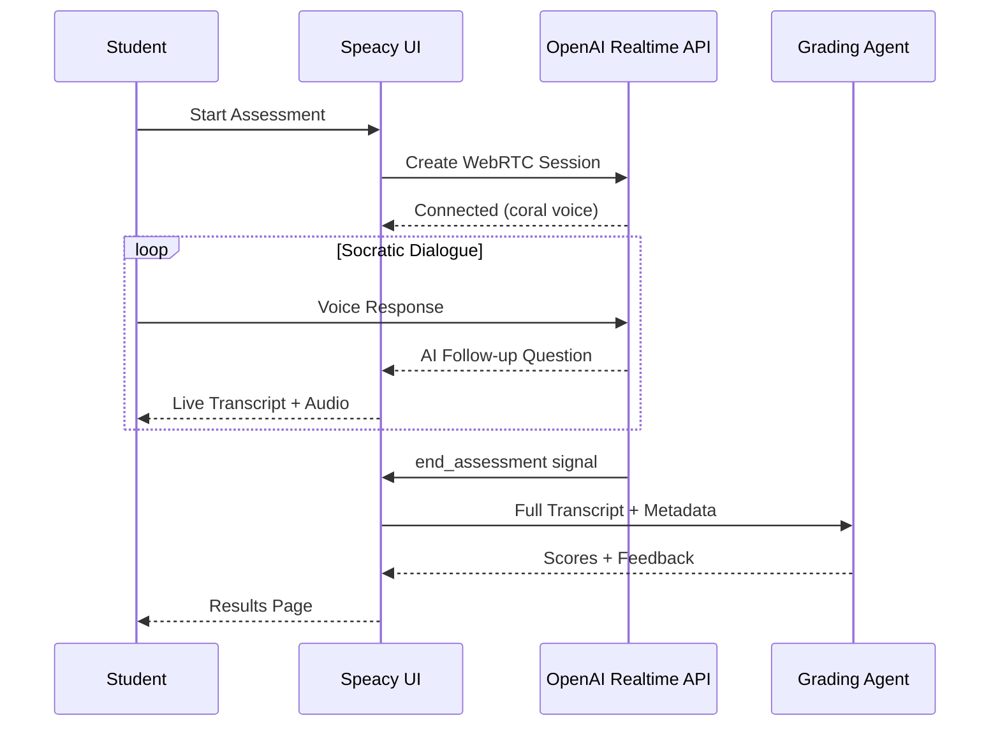

<p align="center">
  
  
  
  
  
  
</p>

# 🎙️ Speacy

**Formative Assessment, Powered by Voice AI.**

Speacy is an experimental platform that leverages OpenAI's Realtime API to conduct **Socratic oral exams**. Instead of measuring rote recall through written tests, Speacy evaluates a student's *reasoning process* through dynamic, AI-driven cross-examination — in real time, with voice.

---

## ✨ Features

### 🧑‍🏫 Instructor Experience
- **Course Management** — Create courses, generate unique join codes, and manage student enrollment
- **Exam Builder** — Create and **edit** exams with title, topic, description, learning goals, and rich markdown context
- **Code Editor Toggle** — Enable/disable the in-exam code editor per assignment and select the programming language (Python, SQL, JavaScript, Java, C++)
- **Auto-Admit Enrollment** — Students join instantly with a course code; professors can remove students if needed
- **Exam Status Control** — Toggle exams between draft, published, and closed states
- **Student Analytics** — View per-student assessment history, scores, and detailed AI-generated feedback

### 🎓 Student Experience
- **Real-Time Voice Exam** — Speak naturally with an AI examiner powered by OpenAI's Realtime API (`coral` voice)
- **Live Transcript** — Chat-style transcript with per-exchange message bubbles, role labels, and grouped consecutive messages
- **Integrated Code Editor** — Write and share code with the AI during the exam (when enabled by the instructor)
- **Contextual Reference Panel** — View instructor-provided markdown materials during the assessment
- **Instant Results** — AI-graded assessment with granular fluency metrics and actionable feedback

### 🛡️ Admin Dashboard
- **User Management** — View all users, roles, and activity
- **Assessment Monitoring** — Track all assessments across courses
- **Audit Logging** — Full audit trail of administrative actions
- **Platform Statistics** — Aggregate stats across users, courses, and assessments

---

## 🏗️ Architecture

```
speacy/
├── app/
│   ├── api/
│   │   ├── session/          # OpenAI Realtime API session creation
│   │   ├── assignments/      # CRUD for exams/assignments
│   │   ├── courses/          # Course management + enrollment
│   │   ├── assessment/       # Assessment record management
│   │   ├── grade/            # AI-powered grading pipeline
│   │   ├── reevaluate/       # Re-evaluation endpoint
│   │   └── admin/            # Admin stats, users, audit logs
│   ├── assessment/           # Live exam interface (WebRTC + voice)
│   ├── dashboard/
│   │   ├── professor/        # Instructor dashboard
│   │   └── admin/            # Admin dashboard
│   ├── results/              # Assessment results view
│   └── login/                # Google OAuth login
├── components/               # Shared UI components
│   ├── Transcript.tsx        # Chat-style conversation display
│   ├── CodePanel.tsx         # In-exam code editor
│   ├── JoinCourseForm.tsx    # Student course enrollment
│   └── ThemeToggle.tsx       # Dark/light mode
├── lib/
│   ├── prompts.ts            # AI examiner prompt builder
│   ├── courses.ts            # Join code generation & validation
│   └── data.ts               # Mock/seed data
└── utils/supabase/           # Supabase client utilities
```

---

## 🔧 Tech Stack

| Layer | Technology |
|-------|-----------|
| **Framework** | Next.js 16 (App Router, Turbopack) |
| **Language** | TypeScript 5 |
| **UI** | React 19, Tailwind CSS 4, Framer Motion |
| **Auth** | Supabase Auth (Google OAuth) |
| **Database** | Supabase (PostgreSQL) |
| **AI Voice** | OpenAI Realtime API (WebRTC) |
| **AI Grading** | OpenAI GPT-4o |
| **Icons** | Lucide React |
| **Markdown** | React Markdown + remark-gfm |

---

## 🚀 Getting Started

### Prerequisites

- Node.js 18+
- A [Supabase](https://supabase.com) project
- An [OpenAI](https://platform.openai.com) API key with Realtime API access

### Setup

1. **Clone the repo**
   ```bash
   git clone https://github.com/shouvikantu/speacy.git
   cd speacy
   ```

2. **Install dependencies**
   ```bash
   npm install
   ```

3. **Configure environment variables**

   Create a `.env.local` file:
   ```env
   NEXT_PUBLIC_SUPABASE_URL=your_supabase_url
   NEXT_PUBLIC_SUPABASE_ANON_KEY=your_supabase_anon_key
   SUPABASE_SERVICE_ROLE_KEY=your_service_role_key
   OPENAI_API_KEY=your_openai_api_key
   ```

4. **Run the development server**
   ```bash
   npm run dev
   ```

5. Open [http://localhost:3000](http://localhost:3000)

---

## 📊 How It Works



---

## 🤝 Contributing

This is a research project. If you're interested in contributing or have feedback, please open an issue or reach out.

---

## 📜 License

© 2025 Speacy Research Project. All rights reserved.
